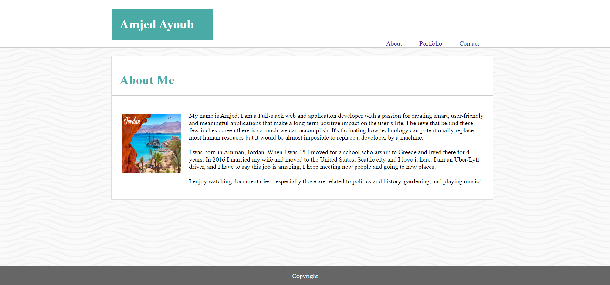
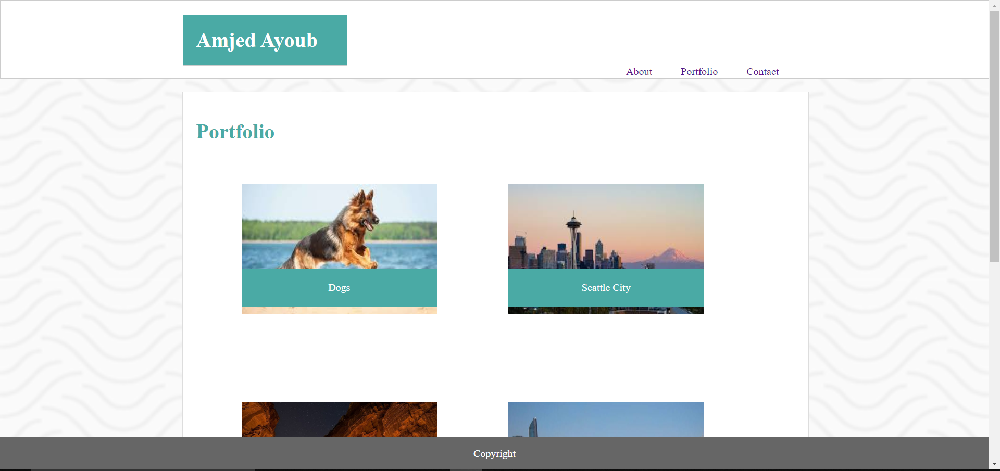
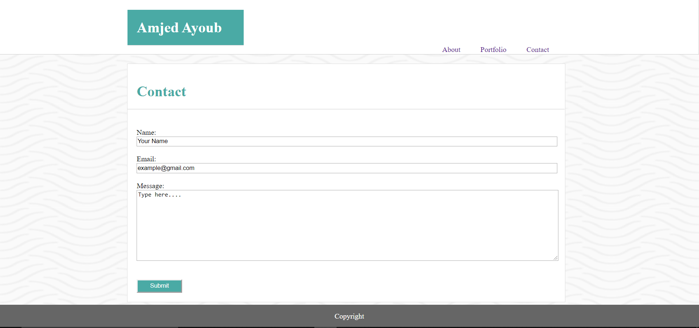

# Basic Portfolio

## Overview

This project is a professional portfolio site using basic HTML and CSS. The site has three pages with fixed Navbar and Footer, 
* "About" which includes a header, image and paragraphs.
* "Portfolio" shows images with labels.
* "Contact" includes a contact form.

## Getting Started
These instructions will get you a copy of the project up and running on your local machine.

### Installing
Git clone the repository to your local machine:

HTTPS:
```
https://github.com/AmjedAyoub/Basic-Portfolio.git
```
SSH:
```
git@github.com:AmjedAyoub/Basic-Portfolio.git
```

## Screen-shots

### About page


### Portfolio page


### Contact page


## Technologies & Tools
* HTML  
* CSS

## Links
This application is deployed on GitHub Pages, [Try it yourself](https://amjedayoub.github.io/Basic-Portfolio).\
This application is published on [GitHub](https://github.com/AmjedAyoub/Basic-Portfolio).

## Authors
See contribution history [here](https://github.com/AmjedAyoub/Basic-Portfolio/graphs/contributors).

## Future updates
At the moment, this app is the minimum viable product. For future updates; improve the UI/UX, and add more functionality and features.